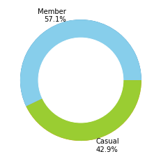
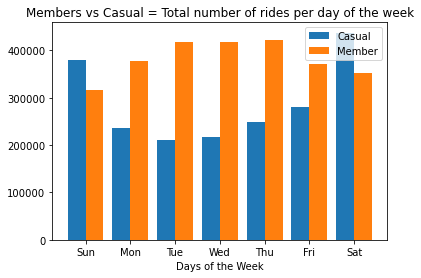
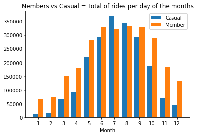

# Cyclistic Bike Share Last 12 Months Analyst
The data is used in this case study to explore how different client types are using Cyclistic bikes. 
The dataset is public and available for download [here](https://divvy-tripdata.s3.amazonaws.com/index.html). The data has been made available by Motivate International Inc under this [license](https://www.divvybikes.com/data-license-agreement). 


## Table of Contents

1. [About the company](README.md##Aboutthecompany)
2. [Statement of the Business task](README.md##StatementoftheBusinesstask)
3. [Dataset](README.md##Dataset)
4. [Data Cleaning](README.md##DataCleaning)

## About the company
In 2016, Cyclistic launched a successful bike-share offering. Since then, the program has grown to a fleet of 5,824 bicycles that
are geotracked and locked into a network of 692 stations across Chicago. The bikes can be unlocked from one station and
returned to any other station in the system anytime.

## Statement of the Business task

To create a better understanding of how annual members and casual riders differ, why casual riders would buy a membership, and how digital media could affect their marketing tactics

## Dataset
For this case study, the available last 12 months of Cyclistic trip data which is between 2021/07-2022/06 are used for analysis.  

```python
# Imported Libraries
import numpy as np    
import csv                                
import os                                 
import glob                               
import pandas as pd                       
import warnings                           
import matplotlib.pyplot as plt           
import difflib                            
import re
import datetime as datetime
from datetime import timedelta
pd.options.mode.chained_assignment = None
import seaborn as sns
%matplotlib inline
```
Data was read by ```pd.read_csv ``` and concated by ```pd.concat``` function.

```python
# Imported Datasets
c2107= pd.read_csv("/Users/seldasezen/Desktop/cyclistic trip data_202107_202206/Trip data_cvs/202107-divvy-tripdata.csv")
c2108= pd.read_csv("/Users/seldasezen/Desktop/cyclistic trip data_202107_202206/Trip data_cvs/202108-divvy-tripdata.csv")
c2109= pd.read_csv("/Users/seldasezen/Desktop/cyclistic trip data_202107_202206/Trip data_cvs/202109-divvy-tripdata.csv")
c2110= pd.read_csv("/Users/seldasezen/Desktop/cyclistic trip data_202107_202206/Trip data_cvs/202110-divvy-tripdata.csv")
c2111= pd.read_csv("/Users/seldasezen/Desktop/cyclistic trip data_202107_202206/Trip data_cvs/202111-divvy-tripdata.csv")
c2112= pd.read_csv("/Users/seldasezen/Desktop/cyclistic trip data_202107_202206/Trip data_cvs/202112-divvy-tripdata.csv")
c2201= pd.read_csv("/Users/seldasezen/Desktop/cyclistic trip data_202107_202206/Trip data_cvs/202201-divvy-tripdata.csv")
c2202= pd.read_csv("/Users/seldasezen/Desktop/cyclistic trip data_202107_202206/Trip data_cvs/202202-divvy-tripdata.csv")
c2203= pd.read_csv("/Users/seldasezen/Desktop/cyclistic trip data_202107_202206/Trip data_cvs/202203-divvy-tripdata.csv")
c2204= pd.read_csv("/Users/seldasezen/Desktop/cyclistic trip data_202107_202206/Trip data_cvs/202204-divvy-tripdata.csv")
c2205= pd.read_csv("/Users/seldasezen/Desktop/cyclistic trip data_202107_202206/Trip data_cvs/202205-divvy-tripdata.csv")
c2206= pd.read_csv("/Users/seldasezen/Desktop/cyclistic trip data_202107_202206/Trip data_cvs/202206-divvy-tripdata.csv")

# Concacted Datasets
c12mnths=pd.concat([c2107, c2108, c2109, c2110, c2111, c2112, c2201, c2202, c2203, c2204, c2205, c2206])

```

There are ```5,900,385``` data collected throughout between ```2021/07 ```and ```2022/06 ``` with ``` 13 ``` variables which are 

* ride_id
* rideable_type
* started_at
* ended_at
* start_station_name
* start_station_id
* end_station_name
* end_station_id
* start_lat
* start_lng
* end_lat
* end_lng
* member_casual

## Data Cleaning

* Data type of ``` started_at ``` and ``` ended_at ``` changed as ```datetime```

```python
#converted column to datetime
c12mnths['started_at']=pd.to_datetime(c12mnths['started_at'])
c12mnths['ended_at']=pd.to_datetime(c12mnths['ended_at'])
```
* The rows with missing values were removed, positive and zero duration between ``` started_at ``` and ``` ended_at ``` were found to investigate ```trip_duration ```.

```python
#Cleaned the rows with missing values
c12mnths.dropna(axis=0, how='any', thresh=None, subset=None, inplace=True)


#Flitered started_at data that is greater than ended_at
c12mnths = c12mnths[c12mnths['started_at'] < c12mnths['ended_at']]
```
* Days and months of the duration were added to create virtualisations based on time bases.
```python
#created a column for weekday
c12mnths['week'] = c12mnths['started_at'].dt.day_name()
#created a column month
c12mnths['month'] = c12mnths['started_at'].dt.month
```
* Trip duration was created as minutes.

```python
#Calculated trip duration
c12mnths['trip_duration'] = c12mnths['ended_at'] - c12mnths['started_at']
#converted trip_duration from format days H:M:S to second
c12mnths['trip_duration'] = c12mnths['trip_duration'].astype('timedelta64[s]')
#convert to minutes
c12mnths['trip_duration'] = c12mnths['trip_duration']/60
c12mnths['trip_duration']=c12mnths['trip_duration'].round(decimals = 2)

```
## Data Analysis and Visualisations

Visualizations were created in Jupiyer Notebook to observe trends between the usage by casual riders and annual members.

### Member vs. Casual = Number of Riders

```57.1% ``` (~2.67 M) of rides were taken by **member riders** and ```42.9% ```(~2 M) of rides were taken by **casual riders** .

```python
casual_tot= casual['ride_id'].count()
print('casual_tot: ', casual_tot)
member_tot= member['ride_id'].count()
print('member_tot: ', member_tot)

```


> **Key insight:** : The graph shows that member customers have taken 14.21 % more rides than casual customers.

### Members vs Casual = Total number of rides per day of the week

**Member customers** have rides ```22.35 %``` more than **casual customers** week. 

```python
casual =  c12mnths.loc[c12mnths['member_casual'] == 'casual']
member = c12mnths.loc[c12mnths['member_casual'] == 'member']

week_day = ['Sunday', 'Monday','Tuesday','Wednesday','Thursday','Friday','Saturday']
tot_casual = []
tot_member = []
scasual = 0
smember = 0
for i in week_day:
  df_casual= casual.loc[casual['week'] == i]
  scasual = df_casual['ride_id'].count()
  tot_casual.append(scasual)


  df_member = member.loc[member['week'] == i]
  smember = df_member['ride_id'].count()
  tot_member.append(smember)

tot_casual=[round(elem, 2) for elem in tot_casual]
tot_member=[round(elem, 2) for elem in tot_member]
    
tot_dow = pd.DataFrame([tot_casual,tot_member],
                            columns = ['Sunday', 'Monday','Tuesday','Wednesday','Thursday','Friday','Saturday'],
                            index = ['casual','member'])             

tot_dow.loc['diff_%'] = ((tot_dow.loc['member'] - tot_dow.loc['casual'])/tot_dow.loc['member'])*100

tot_dow=tot_dow.round(decimals=2)
print(tot_dow)

x = np.arange(len(week_day))
width = 0.4
plt.bar(x-0.2, tot_casual, width)
plt.bar(x+0.2, tot_member, width)

plt.xticks(x, ['Sun', 'Mon','Tue','Wed','Thu','Fri','Sat'])
plt.xlabel("Days of the Week")
plt.legend(["Casual", "Member"])
plt.title('Members vs Casual = Total number of rides per day of the week')
plt.show()

```



> **Key insight:** : Casual customers prefer to take a ride at weekends more than member customers. This result may allow us to assume that member users can be workers who choose to go to work.

### Members vs Casual = Total of rides per day of the months###

**Member customers** have rides ```37.85 %``` more than **casual customers** per year.

```python

casual =  c12mnths.loc[c12mnths['member_casual'] == 'casual']
member = c12mnths.loc[c12mnths['member_casual'] == 'member']

month = [1, 2, 3, 4, 5, 6, 7, 8, 9, 10, 11, 12]
tot_casual_m = []
tot_member_m = []
scasual = 0
smember = 0
for i in month:
  df_casual = casual.loc[casual['month'] == i]
  scasual = df_casual['ride_id'].count()
  tot_casual_m.append(scasual)


  df_member = member.loc[member['month'] == i]
  smember = df_member['ride_id'].count()
  tot_member_m.append(smember)
    
tot_casual_m=[round(elem, 2) for elem in tot_casual_m]
tot_member_m=[round(elem, 2) for elem in tot_member_m]

tot_ride_m = pd.DataFrame([tot_casual_m,tot_member_m],
                           columns = ['1', '2', '3', '4', '5', '6', '7', '8', '9', '10', '11', '12'],
                           index = ['casual','member'])             

tot_ride_m.loc['diff_%'] = ((tot_ride_m.loc['member'] - tot_ride_m.loc['casual'])/tot_ride_m.loc['member'])*100

tot_ride_m=tot_ride_m.round(decimals=2)

print(tot_ride_m)

x = np.array([1, 2, 3, 4, 5, 6, 7, 8, 9, 10, 11, 12])
plt.bar(x-0.2, tot_casual_m, width, label='Casual')
plt.bar(x+0.2, tot_member_m, width, label='Member')

plt.xticks(x, ['1', '2', '3', '4', '5', '6', '7', '8', '9', '10', '11', '12'])
plt.xlabel("Month")
plt.legend()
plt.title('Members vs Casual = Total of rides per day of the months')
plt.legend()
plt.show()
```

> **Key insight:** : Casual customers take more rides in July, and August months than member customers. This result may allow me to assume that July and August customers can consist of tourists who visit the city.



